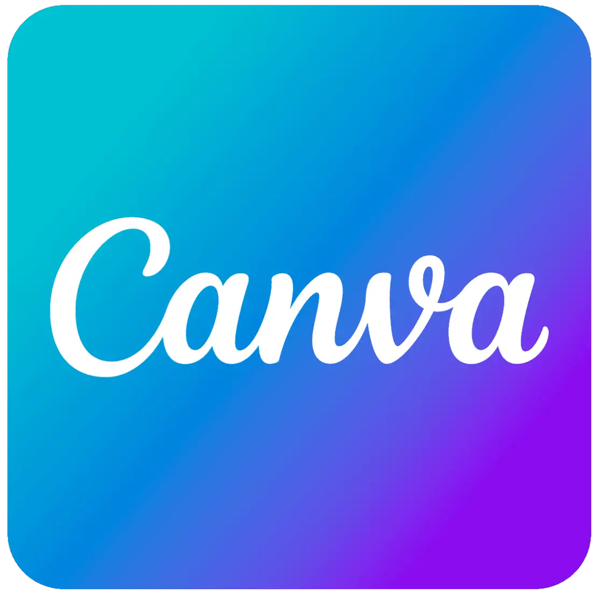

<h1>
  Cao Tiến Cường
</h1>
 
 
 

&nbsp;&nbsp;&nbsp;

&nbsp;&nbsp;&nbsp;

&nbsp;&nbsp;&nbsp;

&nbsp;&nbsp;&nbsp;

 
 

Hi, I'm Cuong, nice to meet you ^^
 
<blockquote>
  I'm a <strong>Software engineering</strong> student with a srtong passion for <strong>backend development</strong> and building reliable, scalable systems.
   
  I enjoy creating in coding and exploring new technologies.
   
  I'm always eager to bring my best to any team I join, with a strong sense of responsibility and dedication.
   
</blockquote>

🙋 About me  
---
<ul>
<li>🎓 I'm learning Software Engineering at SaiGon University</li>
&nbsp;&nbsp;&nbsp;&nbsp;&nbsp;&nbsp;Current GPA: 3.0/4.0
<li>💻 Passionate about coding, love to explore, problem-solving, and constantly learning new technologies.</li>
<li>🌱 Currently exploring web development and backend programming.</li>
<li>🤝 Open to collaboration and always eager to connect with fellow developers.</li>
</ul>

---

✨ Skills
---

  

    <h3>
      Languages
    </h3>
    
    
    
    
    
  

  

    <h3>
      Backend Frameworks/Libraries
    </h3>
    
    
    
    
  

  

    <h3>
      Databases
    </h3>
    
    
    
  

  

    <h3>
      Tools
    </h3>
      
      
      
      
  

